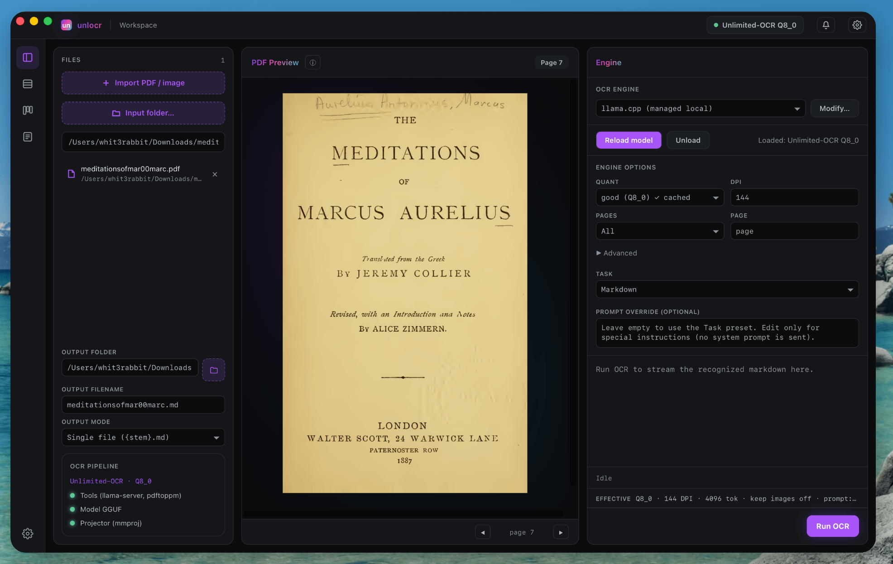

<div align="center">
<pre>
██╗   ██╗███╗   ██╗██╗      ██████╗  ██████╗██████╗
██║   ██║████╗  ██║██║     ██╔═══██╗██╔════╝██╔══██╗
██║   ██║██╔██╗ ██║██║     ██║   ██║██║     ██████╔╝
██║   ██║██║╚██╗██║██║     ██║   ██║██║     ██╔══██╗
╚██████╔╝██║ ╚████║███████╗╚██████╔╝╚██████╗██║  ██║
 ╚═════╝ ╚═╝  ╚═══╝╚══════╝ ╚═════╝  ╚═════╝╚═╝  ╚═╝

GUI/CLI for unlimited-ocr
</pre>

[](https://github.com/whit3rabbit/unlocr/actions/workflows/ci.yml)
[](https://crates.io/crates/unlocr)
[](https://github.com/whit3rabbit/unlocr/releases)
[](https://github.com/whit3rabbit/unlocr/blob/main/LICENSE)
</div>

<p align="center">
  <a href="README.md">English</a> | <b>简体中文</b>
</p>

<p align="center">
  <a href="assets/unlocr-screenshot.png" target="_blank">
    
  </a>
</p>

**与 Unlimited OCR 无官方关联，仅为其封装库/GUI。**

一个快速、轻量级的工具，用于将 PDF OCR 转换为干净的 Markdown。它由本地通过 **`llama.cpp`** (GGUF) 运行的 **[Unlimited-OCR](https://huggingface.co/sahilchachra/Unlimited-OCR-GGUF)** 模型 (DeepSeek-OCR 3B VLM) 提供动力。

目前仍在开发中 (WIP)，系统要求较高。请勿指望它能在低配置设备上运行。创建此项目的目的是为了在本地计算机上使用 unlimited-ocr，它与原版 unlimited-ocr 无关联。

这是凭感觉编写的代码（vibe coded），所以不要指望一切都完美无瑕。欢迎提交 PR。UI 是通过 Claude Design 完成的。

### 核心特性

*   **本地 & 安全**：完全离线在您的 CPU 或 GPU 上运行。
*   **自动缓存**：首次运行时，模型权重会从 Hugging Face 自动下载。
*   **高性能**：使用单个持久的 `llama-server` 后台进程，避免跨页面重新加载的开销。
*   **灵活的引擎**：支持 GGUF（默认，通过 llama.cpp）或 GPU 上的完整未量化模型（通过 vLLM/SGLang）。
*   **多平台**：适用于 **macOS、Linux 和 Windows**，同时提供 **CLI** 和 **桌面 GUI** 应用程序。

---

## 系统要求

要运行 `unlocr`，您需要：
1.  **poppler**（提供 `pdftoppm` 用于将 PDF 页面栅格化为图像）。
2.  **llama-server** —— 一个**已修补**的 `llama.cpp` 构建，包含来自 PR [#24975](https://github.com/ggml-org/llama.cpp/pull/24975) 的 Unlimited-OCR R-SWA 支持。该 PR 尚未合并到上游，因此官方/Homebrew/apt 构建**无法**工作。**unlocr 会在首次运行时为您自动下载其专属的修补构建**（CLI 和 GUI）——您不需要手动安装。请参见下文的说明。
3.  **pandoc** *(可选)* —— 仅用于 GUI 的“导出为 DOCX/ODT/RTF/HTML/TXT”功能。没有它 OCR 也能正常工作。
4.  **Rust 工具链**（仅在从源码构建或通过 cargo 安装时需要）。

#### 各平台依赖项提供方式

**CLI** 和 **桌面 GUI** 都会在首次运行时自动将 sha256 固定的修补版 `llama-server` 下载到应用缓存中（macOS arm64/x64、Linux x64、Windows x64；CPU 构建，macOS 使用 Metal）。您只需提供 `pdftoppm`：

| 操作系统 | poppler (`pdftoppm`) | llama-server (修补的 R-SWA 构建) | pandoc (导出) |
|----|----------------------|------------------------------------|-----------------|
| **Windows** | GUI 会为您下载 | **自动下载** (CLI + GUI) | GUI 会为您下载 |
| **Linux** | 通过 `.deb`/`.rpm` 安装 (声明的依赖) | **自动下载** (CLI + GUI, x86_64) | 通过 `.deb`/`.rpm` 安装 (推荐的依赖) |
| **macOS** | `brew install poppler` (cask 依赖) | **自动下载** (CLI + GUI) | GUI 会下载，或运行 `brew install pandoc` |

> [!NOTE]
> 修补后的 `llama-server` 由 unlocr 自身的 CI (`build-llama.yml`) 构建，并托管在专用的 `llama-rswa-*` GitHub Release 上。在 GUI 中，**设置 → 依赖项 (Settings → Dependencies)** 会显示已找到/缺失的项，并可以（重新）下载。如果您将 unlocr 指向您**自己**的 `llama-server`（`--llama-bin`，或 `PATH`/Homebrew 中的一个），它会被使用，但您会收到一条警告，提示无法验证其是否支持 R-SWA；可以使用 `UNLOCR_ALLOW_EXTERNAL_LLAMA=1` 消除此警告。GPU 用户（CUDA/Vulkan）应自行从 PR #24975 构建 llama.cpp 并传入 `--llama-bin`。

### 模型变体 & 系统规范

默认情况下，`unlocr` 在 `llama.cpp`（CPU 或 GPU 卸载）上运行量化的 GGUF。您还可以通过 `vLLM` 在专用 GPU 上运行未量化的完整模型。

| 模式 | 变体 | 下载大小 | 所需 RAM/VRAM | 引擎 | 质量标志 |
|------|---------|---------------|-------------------|--------|--------------|
| **GGUF** | `Q4_K_M` | 1.82 GB | ~4 GB RAM | llama.cpp | `--quality less` |
| **GGUF** | `Q8_0` *(默认)* | 2.91 GB | ~6 GB RAM | llama.cpp | `--quality good` |
| **GGUF** | `BF16` | 5.47 GB | ~8 GB RAM | llama.cpp | `--quality best` |
| **完整模型** | `DeepSeek-OCR` | ~6.7 GB | 16 GB+ VRAM | vLLM | `--gpu` |

### 如何按操作系统安装

所有安装文件（预构建的二进制文件、桌面安装程序和软件包）都可以在 **[GitHub Releases](https://github.com/whit3rabbit/unlocr/releases)** 页面上找到。

*   **macOS (Apple 芯片 & Intel)**:
    *   **GUI（桌面应用）**：从 [Releases](https://github.com/whit3rabbit/unlocr/releases) 下载 `.dmg` 安装程序（或通过 Homebrew Cask 安装：`brew install --cask whit3rabbit/tap/unlocr`）
    *   **CLI**：`brew install whit3rabbit/tap/unlocr`
*   **Windows**:
    *   **GUI**：从 [Releases](https://github.com/whit3rabbit/unlocr/releases) 下载 `.msi` 安装程序
    *   **CLI**：从 [Releases](https://github.com/whit3rabbit/unlocr/releases) 下载 CLI zip 文件
*   **Linux**:
    *   **GUI**：从 [Releases](https://github.com/whit3rabbit/unlocr/releases) 下载 `.AppImage`、`.deb` 或 `.rpm` 软件包
    *   **CLI**：从 [Releases](https://github.com/whit3rabbit/unlocr/releases) 下载 `.tar.gz` 软件包

---

#### macOS
`poppler` 需要使用 Homebrew 安装（unlocr 会自动下载修补后的 `llama-server` 本身；**切勿**运行 `brew install llama.cpp` —— Homebrew 构建缺少 R-SWA）。安装先决条件：
```bash
brew install poppler   # pandoc 可选，仅用于 GUI 导出：brew install pandoc
```
然后使用 Homebrew 安装 `unlocr`：
```bash
# 安装 CLI 工具
brew install whit3rabbit/tap/unlocr

# 或安装 GUI 桌面应用程序
brew install --cask whit3rabbit/tap/unlocr
```
> [!NOTE]
> 对于未签名的 macOS GUI应用，Homebrew 会自动处理隔离标志。如果是手动下载的，请运行：
> `xattr -dr com.apple.quarantine "/Applications/unlocr.app"`

#### Linux
1. 从 [GitHub Releases](../../releases) 下载预构建的 CLI 二进制文件或 GUI 安装程序（`.AppImage`、`.deb`、`.rpm`）。
2. `.deb`/`.rpm` 将 **poppler**（以及 GUI 导出的 **pandoc**）声明为依赖项，因此您的包管理器会自动拉取它们。
3. **`llama-server` 会自动下载** (x86_64) —— unlocr 会在首次运行时将其修补后的 R-SWA 构建 (PR #24975) 获取到应用缓存中；您不需要手动安装 `llama.cpp`。（其他架构，例如 arm64，没有固定的下载链接：请从 PR #24975 构建 llama.cpp 并传入 `--llama-bin`。）

#### Windows
1. 从 [GitHub Releases](../../releases) 下载 CLI 可执行文件或 Windows GUI 安装程序 (`.msi`)。
2. **GUI**：无需手动设置 —— 打开 **设置 → 依赖项 (Settings → Dependencies)** 并点击 Download 即可下载任何依赖项。GUI 会将 sha256 固定的 `pdftoppm`、修补后的 `llama-server` 和 `pandoc` 获取到其缓存中（GPU 用户应从 PR #24975 构建 llama.cpp 并传入 `--llama-bin`）。
3. **CLI**：修补后的 `llama-server` 会在首次运行时自动下载；只需确保 `pdftoppm` 在您的 `PATH` 中，然后运行安装程序或脚本：
   ```powershell
   powershell -ExecutionPolicy Bypass -File packaging\windows\install.ps1
   ```

#### 备选方案：通过 Cargo 安装 (CLI)
如果您已安装 Rust 工具链：
```bash
cargo install unlocr
```

#### 备选方案：从源码构建
```bash
# 克隆仓库并运行安装脚本 (macOS/Linux)
./install.sh
```
*(有关 Windows 源码安装的详细信息，请参见 [packaging/README.md](packaging/README.md)。)*

---

## 如何运行

### 桌面 GUI 应用
只需从您的操作系统“应用程序”文件夹（或“开始”菜单）启动已安装的 **unlocr** 应用程序即可。GUI 提供了一个直观的界面，用于加载 PDF、选择质量预设、自定义提示词并启动 OCR 过程。

### CLI 工具
通过传入一个或多个 PDF 来运行 `unlocr`：
```bash
unlocr <input.pdf> [more.pdf ...] [options]
```

**示例**：
```bash
unlocr report.pdf --out ./out --quality best
# 生成 ./out/report.md，并带有页面分隔的 <!-- page N --> 标记
```

---

## 开发者参考 & CLI 参数

有关所有 CLI 参数、采样配置和高级设置的完整深入指南，请参阅 [docs/CLI_zh.md](docs/CLI_zh.md)。

### CLI 参数 & 选项

| 选项 | 默认值 | 描述 |
|--------|---------|-------------|
| `--out DIR` | `.` | 转换后的 Markdown 文件的输出目录。 |
| `-o, --output FILE` | *(来自输入名称)* | 单个输出文件路径（仅限单输入）。无扩展名时会自动追加 `.md`；如果是相对路径，则会在 `--out` 目录下拼接。 |
| `--recursive` | `false` | 当输入是文件夹时，递归进入子目录。 |
| `--from-list FILE` | *(无)* | 从文本文件中读取额外的 PDF 路径（每行一个；跳过 `#` 注释和空行）。 |
| `--password PW` | `UNLOCR_PDF_PASSWORD` | 加密 PDF 的用户/打开密码。`--password` 会覆盖环境变量。建议使用 `UNLOCR_PDF_PASSWORD` 环境变量或 `--password-file`，以避免密码出现在 shell 历史记录和 unlocr 自身的 argv 中。（注意：poppler（pdfinfo/pdftoppm）仍会以 `-upw` 接收该密码，因此无论使用哪种来源，在这些子进程运行期间密码都会出现在进程列表中。） |
| `--password-file FILE` | *(无)* | 候选 PDF 密码的文本文件（每行一个；跳过 `#` 注释和空行）。每个 PDF 会依次尝试每个密码直到解锁，因此可处理使用不同密码的批量文件。无法解锁的 PDF 会被跳过（并记录），批处理继续进行。 |
| `--quality TIER` | `good` | 质量预设。选项：`best` (BF16), `good` (Q8_0), `less` (Q4_K_M)。 |
| `--quant TAG` | *(来自质量)* | 精确的 Hugging Face 模型量化标签（例如 `Q6_K`, `IQ4_XS`）。会覆盖 `--quality`。 |
| `--model PATH` | *(HF 下载)* | 直接使用此 GGUF 文件，跳过 HF 下载和命名规范。这会禁用 `--quant`/`--quality`/`--model-dir` 的选择。 |
| `--mmproj PATH` | *(缓存的投影器)* | 投影器 (mmproj) GGUF 覆盖。需要与 `--model` 配合使用。 |
| `--max-tokens N` | `4096` | 每页生成的最大 token 数（防止密集页面上的无限循环/失控）。 |
| `--pages RANGE` | *(所有)* | 要进行 OCR 的页面：单页 (`5`) 或包含两端的、基于 1 的范围 (`5-9`)。应用于每个输入。 |
| `--task PRESET` | `markdown` | 提示词预设：`markdown`（干净的 md）、`grounding`（md + 布局坐标）、`free`（纯文本）、`figure`（解析图表/插图）。 |
| `--prompt TEXT` | *(来自任务)* | 自定义 OCR 提示词。会覆盖 `--task`。使用 `<|grounding|>` 获取布局坐标。 |
| `--dpi N` | `144` | PDF 页面渲染 DPI（较高的 DPI 可以获得更大/更清晰的源图像）。 |
| `--image-max-tokens N` | *(模型默认值)* | `llama-server` 的视觉 token 预算（仅限本地模式）。越高意味着细节识别越精细，但速度越慢/占用 VRAM 越多。 |
| `--chat-template NAME` | *(模型默认值)* | 转发给 `llama-server --chat-template`（例如 `deepseek-ocr`）；仅限本地模式。 |
| `--repeat-penalty F` | `1.3` (本地 GGUF) / *(服务器默认值)* (`--endpoint`/`--gpu`) | 采样重复惩罚项；有助于打破较小量化模型中的生成循环。 |
| `--llama-bin PATH` | *自动检测* | `llama-server` 二进制文件的路径。 |
| `--model-dir PATH` | *系统缓存* | 缓存 GGUF 模型下载的自定义目录。 |
| `--port N` | `0` (自动) | 启动的 `llama-server` 所使用的端口。 |
| `--keep-images` | `false` | 保留处理过程中生成的中间页面 PNG。 |
| `--gpu` | `false` | 通过本地 vLLM 运行完整的 DeepSeek-OCR 模型。`--endpoint http://localhost:8000 --endpoint-model deepseek-ai/DeepSeek-OCR` 的快捷方式。 |
| `--endpoint URL` | *本地启动* | 将请求路由到远程的兼容 OpenAI 的服务器（vLLM、SGLang 等），并跳过本地启动。 |
| `--endpoint-key KEY`| `UNLOCR_API_KEY` | `--endpoint` 的 Bearer API 令牌（或通过 `UNLOCR_API_KEY` 环境变量设置）。 |
| `--endpoint-model M`| *(无)* | 发送到端点请求体中的模型名称（vLLM/LiteLLM 网关需要）。 |

**子命令**：`unlocr doctor`（别名 `preflight`）在不运行 OCR 的情况下验证系统依赖项、模型文件、内存和磁盘空间。接受参数 `--llama-bin`、`--model-dir`、`--quant`。

### 工作原理

1.  **预检**：定位 `llama-server`（优先使用 unlocr 缓存的修补后 R-SWA 构建，如果不存在则自动下载）并定位 `pdftoppm`。如果使用了外部的 `llama-server` (`--llama-bin` 或位于 `PATH` 中)，则会显示一条警告，提示无法验证其是否支持 R-SWA（可通过设置 `UNLOCR_ALLOW_EXTERNAL_LLAMA=1` 消除该警告）。
2.  **模型缓存**：检查缓存目录中是否存在 `Unlimited-OCR-<quant>.gguf` 和 `mmproj-Unlimited-OCR-F16.gguf`，如果缺失则从 HF 下载。
3.  **启动服务器**：启动一个后台 `llama-server` 实例，并轮询 `/health` 直至其处于活动状态。
4.  **OCR 处理**：对于每个 PDF，运行 `pdftoppm` 将页面提取为 PNG 图像，依次将它们（进行 base64 编码）POST 发送至 `/v1/chat/completions`，并追加生成的 markdown 输出。

### 模型缓存

GGUF 文件会在本地进行缓存。它们的文件体积可能相当大（根据下载的量化模型，总大小约为 1.8 GB 至 8.0 GB 之间）。

| 操作系统 | 默认缓存路径 |
|----|--------------------|
| **macOS** | `~/Library/Caches/unlocr` |
| **Linux** | `$XDG_CACHE_HOME/unlocr` (或 `~/.cache/unlocr`) |
| **Windows**| `%LOCALAPPDATA%\unlocr` |

*可使用 `--model-dir PATH` 或 `$XDG_CACHE_HOME` 环境变量来覆盖此路径。*

### 卸载 & 回收空间

要删除应用程序二进制文件并清除下载的模型权重，请运行：
*   **macOS/Linux**：`./uninstall.sh`
*   **Windows**：`powershell -ExecutionPolicy Bypass -File packaging\windows\uninstall.ps1`

### 在 GPU 上运行完整模型 (vLLM)

对于未量化模型的高性能 GPU 服务化部署：
1.  安装 vLLM（推荐预发布版本以支持 DeepSeek-OCR）：
    ```bash
    pip install -U vllm --pre --extra-index-url https://wheels.vllm.ai/nightly
    ```
2.  部署服务：
    ```bash
    vllm serve deepseek-ai/DeepSeek-OCR \
      --no-enable-prefix-caching \
      --mm-processor-cache-gb 0 \
      --logits-processors vllm.model_executor.models.deepseek_ocr:NGramPerReqLogitsProcessor
    ```
3.  运行 `unlocr` 并指向该端点：
    ```bash
    unlocr report.pdf --gpu
    ```
    *(在 GUI 中，选择 **GPU 完整模型 (vLLM · DeepSeek-OCR)** 引擎预设。)*

> [!TIP]
> **Google Colab**：查看 Google Colab 笔记本，在免费的 Colab T4 云实例上运行完整的 GPU 流水线：
> - **English**: [`colab/unlocr-deepseek-ocr-gpu.ipynb`](colab/unlocr-deepseek-ocr-gpu.ipynb) [](https://colab.research.google.com/github/whit3rabbit/unlocr/blob/main/colab/unlocr-deepseek-ocr-gpu.ipynb)
> - **简体中文**: [`colab/unlocr-deepseek-ocr-gpu_zh.ipynb`](colab/unlocr-deepseek-ocr-gpu_zh.ipynb) [](https://colab.research.google.com/github/whit3rabbit/unlocr/blob/main/colab/unlocr-deepseek-ocr-gpu_zh.ipynb)

### 非官方基准测试

*   **硬件**：macOS (Apple Silicon, Metal)
*   **llama.cpp**：构建版本 b9770
*   **模型**：BF16 (`--quality best`, 5.47GB)
*   **文档**：355 页的图书 PDF (~12.4MB), 144 DPI

| 指标 | 结果 |
|--------|--------|
| **冷启动（加载模型）** | ~15 秒 |
| **总处理时间** | 42 分 44 秒 (~7.2秒/页) |
| **输出大小** | 1.2 MB markdown (~19.2万字) |

*较小体积的量化模型（`--quality good` / `less`）以牺牲精度为代价，来换取更快的速度和更小的下载体积。*

### 局限性与安全性

*   **Ctrl-C (SIGINT)**：中断 CLI 并不会清理后台服务器进程，这可能会导致 `llama-server` 变成孤儿进程。
*   **异常退出 (macOS)**：如果应用被强制杀掉（`SIGKILL`/段错误）或崩溃发生恐慌（`panic=abort`），则会跳过清理。Linux (`PR_SET_PDEATHSIG`) 和 Windows (工作对象 Job Objects) 会随父进程一同杀死 `llama-server`；macOS没有等效机制，因此处于运行状态的服务器可能会变成孤儿进程。可以使用 `pkill llama-server` 进行恢复。
*   **端口抢占 (Port Race)**：空闲端口分配有时可能会发生冲突；请使用 `--port N` 来绑定固定端口。
*   **身份验证**：本地 `llama-server` 绑定到 `127.0.0.1` 且无身份验证。在多用户机器上，其他本地用户可能会在执行期间访问该服务器端口。建议在单用户环境下运行。
*   **空白/带下划线/低内容页面上的重复循环**：底层的 Unlimited-OCR/DeepSeek-OCR 模型在空白区域、下划线/实线或其它低内容输入上，可能会退化为重复或幻觉输出（例如，喋喋不休地谈论“Ground Truth 图像”而不是转录）。这是一个公开且目前尚未解决的上游模型问题（[deepseek-ai/DeepSeek-OCR#151](https://github.com/deepseek-ai/DeepSeek-OCR/issues/151)），而不是 unlocr 提示词的 bug：上游的 vLLM/SGLang 服务通过一个自定义的 n-gram 重复 logits 处理器来抑制它，而该处理器目前没有 `llama.cpp`/`GGUF` 的等效物。如果遇到此情况，**首先确认您使用的是 unlocr 托管的 R-SWA 构建**，而不是官方/PATH/Homebrew 版本的 `llama-server`：未修补的构建无法加载视觉塔，这是导致 `ocr-ocr` 式重复循环的最常见原因（此时 GUI 管道会显示黄色的 "external" 标志；CLI 的 `doctor` 命令会打印来源 provenance）。然后尝试社区为密集/数学页面发现的防循环 DRY 参数：`--dry-allowed-length 2 --dry-penalty-last-n -1`（GUI 的 **防循环（针对密集页面）Anti-loop (dense pages)** 开关会同时设置这两项），提高 `--repeat-penalty`（例如 `1.5`），提高 `--dry-multiplier`，或使用更高精度的量化模型（选择 `--quality best`/`good` 而非 `less`）。如果在未自然停止的情况下页面的生成达到了 `--max-tokens`，系统会发出警告（很可能是陷入了重复循环），而不是像它是真实文本一样将其默默写入。

### 许可证

`unlocr` 代码库根据 [MIT 许可证](LICENSE) 发布。请注意，从 Hugging Face 自动下载的模型权重受其各自许可证的约束（参见 HF 模型卡）。
